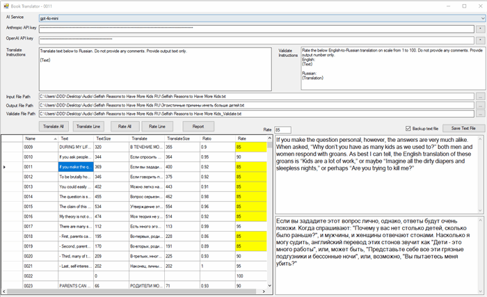

This app will translate a book by sending each line to OpenAI or Anthropic. It will then rate each translation and let you make corrections.

Originally posted here:
<https://www.codeproject.com/Articles/5385874/AI-Book-Translator/>

If you have a pdf file, the text file needs to be generated by opening the pdf file in Word and copied and pasted to a text file. Open the text file in a text editor that has line numbers such as Notepad2. Open the file in and remove text that would not be read like: table of contents, footnotes, index and references. Each paragraph must be on one line. 

This app will translate a book by sending each line to OpenAI or Anthropic.  It will then rate each translation and let you make corrections. It will color-code each rating if it is below 90% and let you soft for lowest to highest rating. 

Click "Translate All" to translate all lines and save the translation output file.
Click "Translate Line" to translate the selected line
Click "Rate All" to rate all lines and save the Validate file.
Click "Rate Line" to rate the selected line
The app will also create a Ratio of the length of original text to the the translated text to detect outliers. 

The Report button will create an HTML document you can email to someone to review the final translations and ratings. 



Creating a Text document out of PDF can be vary time consuming. I am planning to create another project that would do so by using OpenAI Vision API.  For now the best way is to upload your PDF file to Google Drive.  Google will automatically OCR it for you.  Next use AutoHotkey  convert the PDF to text so that each paragraph is a line of text.  For example, by using this AutoHotkey code below you can highlight a  paragraph in PDF file and press Windows Key.  AutoHotkey will append the text to your Text file.

```autohotkey
#Persistent
#SingleInstance Force
; Define the hotkey Ctrl + Shift + C
~LWin::
    Clipboard := ""
    Send, ^c
    ClipWait, 4
    selectedText := Clipboard
    StringReplace, selectedText, selectedText, `r`n, %A_Space%, All
    StringReplace, selectedText, selectedText, `n, %A_Space%, All
    StringReplace, selectedText, selectedText, `t, %A_Space%, All
    filePath := "C:\Audio\Test.txt"
    FileAppend, %selectedText%`r`n, %filePath%, UTF-8
return
```

First you need to get the  AI API Key from Open AI, Anthropic or both.

OpenAI (https://platform.openai.com)
Anthropic (https://console.anthropic.com)
The code basically send the HTTP JSON request using HttpWebRequest.
